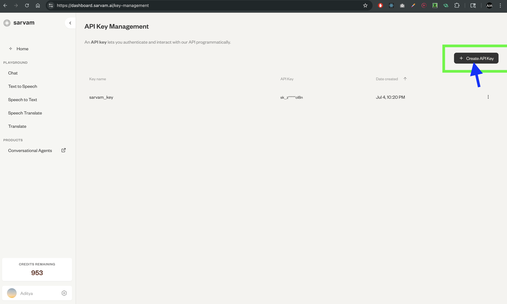
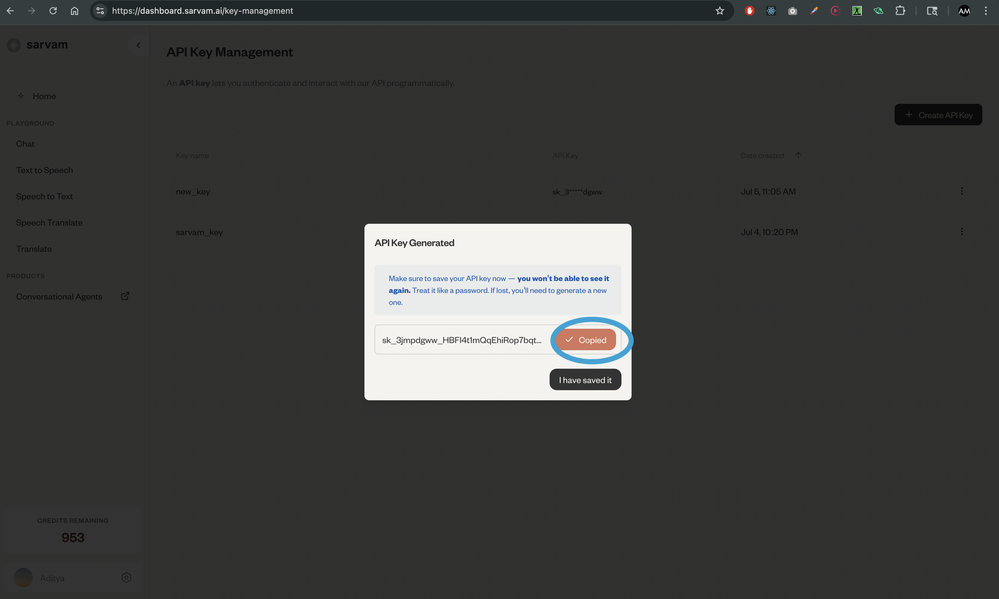

# AI Conversational using sarvamai

A pair of Streamlit applications demonstrating real-time speech-to-text, translation, chat completion, and text-to-speech pipelines using the **sarvamai** API (with support for Indian languages). One app drives an **AI** persona in a target language, and the other simulates a **human** conversational counterpart.

---

## 🚀 Features

* **ai\_conversation\_buddy\_app.py**
  • Record your voice → transcribe → translate → generate AI response → play back in both source and target languages.
  • Supports multiple Indic languages (Hindi, Kannada, Tamil, Telugu, Bengali, Marathi, etc.).

* **human\_conversation\_app.py**
  • Record → transcribe → translate your message.
  • Loops translations back as a human-style echo or integrate custom logic.

* **Notebooks**
  • `notebooks/sarvam_pipeline_demo.ipynb` walks through the sarvamai pipeline in Jupyter.
  • Sample audio: `notebooks/sample_hindi.wav`, `notebooks/output_audio.wav`.

---

## 📦 Prerequisites

* Python 3.12+
* [uv](https://astral.sh/uv/) for environment/dep management
* A valid **sarvamai** API key (create/manage at [https://dashboard.sarvam.ai/key-management](https://dashboard.sarvam.ai/key-management))

---

## 🛠️ Installation & Setup

1. **Clone the repo**

   ```bash
   git clone <your-repo-url>
   cd <repo-directory>
   ```

2. **Install uv and Python** (if needed):

   ```bash
   curl -LsSf https://astral.sh/uv/install.sh | sh
   uv python install 3.12
   ```

3. **Activate the UV environment**:

   ```bash
   uv activate
   ```

4. **Install dependencies**:

   ```bash
   pip install -r requirements.txt
   ```

5. **Configure your API key**:
   * Go to https://dashboard.sarvam.ai/signin and sign in/create saravami ai account.
   * Get the Sarvamai API key from your dashboard https://dashboard.sarvam.ai/key-management. You will get 1000 free credits to start with.
> 
> 
> 

   * Copy `.env.template` to `.env` or edit `./.streamlit/secrets.toml`.
   * Add:

     ```ini
     SARVAM_API_KEY = "sk_xxxx..."
     ```

---

## 🎬 Running the Apps

* **AI Conversation Buddy**

  ```bash
  streamlit run ai_conversation_buddy_app.py
  ```

* **Human Conversation Simulator**

  ```bash
  streamlit run human_conversation_app.py
  ```

Open the URL shown in your browser to interact.

---

## 📂 Directory Structure

```
├── ai_conversation_buddy_app.py
├── human_conversation_app.py
├── notebooks/
│   ├── sarvam_pipeline_demo.ipynb
│   ├── sample_hindi.wav
│   └── output_audio.wav
├── pyproject.toml
├── requirements.txt
├── uv.lock
├── .env.template
└── .streamlit/
    └── secrets.toml
```

---

## 📝 Tips & Notes

* Grant microphone permissions in your browser.
* Adjust `fs` (sample rate) and `max_duration` to suit your setup.
* Monitor remaining credits on your dashboard: [https://dashboard.sarvam.ai/dashboard](https://dashboard.sarvam.ai/dashboard)

---

## 🤝 Contributing

PRs welcome! Feel free to open issues for bugs or feature requests.

---

© 2025 Your Name or Organization
